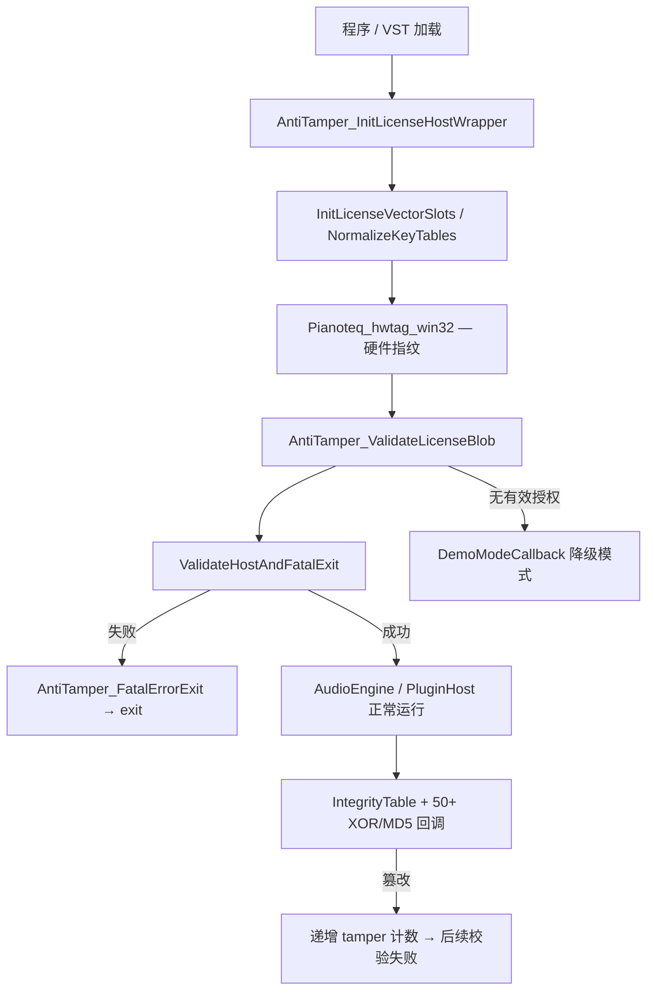

[TOC]


# StdVector_Uint32_Assign

`ReplaceBufferWithBufferContents` 已分析并重命名为 **`StdVector_Uint32_Assign`**（`0x7641a4`），修改已保存。

## 功能分析

这是 **libstdc++ `std::vector<uint32_t>` 的拷贝赋值辅助函数**，等价于：

```cpp
std::vector<uint32_t>& operator=(const std::vector<uint32_t>& src);
```

向量在内存中以 **3 指针描述符** 表示（`void** dest_vec`）：

| 索引  | 含义                                |
| ----- | ----------------------------------- |
| `[0]` | `_M_start`（begin）                 |
| `[1]` | `_M_finish`（end）                  |
| `[2]` | `_M_end_of_storage`（capacity_end） |

### 执行流程

```
1. 若 dest_vec == src_vec → 自赋值，直接返回
2. 计算 src 元素个数 = (src.end - src.begin) / 4
3. 分支：
   ├─ 容量不足 → operator new → memmove 全量复制 → 释放旧缓冲区
   └─ 容量足够
       ├─ dest.size() >= src.size() → 一次 memmove
       └─ dest.size() < src.size()  → 两段 memmove（先填已有区，再写尾部）
4. 更新 dest.end = dest.begin + 4 * element_count
5. 返回 dest_vec
```

被大量 Pianoteq 代码调用（`fourierbmp`、`vstpianoeditor`、`vstprograms`、`env.hh` 等），用于复制 `uint32` 数组型向量数据。

## 重命名

| 原名                              | 新名                                |
| --------------------------------- | ----------------------------------- |
| `ReplaceBufferWithBufferContents` | **`StdVector_Uint32_Assign`**       |
| `dest`                            | `dest_vec`                          |
| `src`                             | `src_vec`                           |
| `Src`                             | `src_begin_ptr`                     |
| `v3`                              | `dest_begin_ptr`                    |
| `Size`                            | `src_byte_size`                     |
| `v5`                              | `src_element_count`                 |
| `v6`                              | `dest_size_elements`                |
| `v7`                              | `dest_begin_after`                  |
| `v9` / `v10`                      | `new_buf_byte_size` / `new_buf_ptr` |
| `v11`                             | `element_count`                     |

原函数名 `ReplaceBufferWithBufferContents` 过于笼统；`StdVector_Uint32_Assign` 与项目中 `StdString_*`、`StdList_*` 命名风格一致，并准确表达 **uint32 向量拷贝赋值** 语义。

## 注释位置

已在以下关键点添加中英对照注释：

- 函数头（整体语义 + 三指针布局）
- 自赋值检测（`0x7641be`）
- 容量判断与重分配（`0x7641db` / `0x764246`）
- 两段 memmove 路径（`0x7641f8` / `0x76421c`）
- end 指针更新与返回值（`0x764229` / `0x764237`）

# VoiceStats_ComputeSoundReleaseTime


`VoicePart_ComputeReleaseTimeFactor` 已分析完毕，函数名已修正，变量重命名与中英注释已写入 `Pianoteq23.exe.i64`。

## 功能分析

该函数**不是**单个 `VoicePart` 对象的方法，而是从**全局释音统计块** `g_VoiceReleaseStats`（`0x7E1840`）计算 UI 显示的 **「Sound Release Time」**。

### 数据流

```
演奏时 AudioFilter_FillOutputBuffer(..., &g_VoiceReleaseStats)
    → 累计 RDTSC、采样工作量、能量等到统计块

UI 调用 VoiceStats_ComputeSoundReleaseTime(&g_VoiceReleaseStats)
    → 返回 0：显示 "[not yet available, play more]"
    → 返回 >0：round() 后以整数显示
```

### 算法（等价伪代码）

```c
// 能量缩放系数 = 1e-12
if (scale * (stats[+0x08] + stats[+0x30]) <= 0.2) return 0;
if (scale * stats[+0x148] <= 0.2) return 0;

active  = scale * (stats[+0x08] + stats[+0x30]);
damped  = scale * (stats[+0xF8] + stats[+0x120]);
delta   = active - damped;

term1 = (delta > 0) ? 2 * (stats[+0x20] + stats[+0x48]) / delta * 1e-6 : 0;
term2 = stats[+0x160] / (scale * stats[+0x148]) * 1e-6;

return (term1 + term2) / 700;   // k_VoiceStats_OutputScale = 1/700
```

### 统计块关键偏移

| 偏移               | 用途                     |
| ------------------ | ------------------------ |
| `+0x08` / `+0x30`  | 累计激活能量（门限判断） |
| `+0x20` / `+0x48`  | 释音时间分子累加器       |
| `+0xF8` / `+0x120` | 阻尼/衰减能量            |
| `+0x148`           | 参考能量（门限 + 分母）  |
| `+0x160`           | 参考校正分子             |

---

## 函数名判断

| 原名称                               | 问题                                                         | 新名称                                   |
| ------------------------------------ | ------------------------------------------------------------ | ---------------------------------------- |
| `VoicePart_ComputeReleaseTimeFactor` | ① 参数不是 VoicePart 实例，而是全局统计块<br>② 返回值是 UI 显示的 **Sound Release Time**，不是无量纲 “Factor” | **`VoiceStats_ComputeSoundReleaseTime`** |

`VoicePart_` 前缀不准确；`Factor` 易误解为系数，实际是可四舍五入显示的**时间标量**。

---

## 重命名摘要

**函数：** `VoiceStats_ComputeSoundReleaseTime`（`0x40E800`）

**参数：** `arg1` → `release_stats`

**全局：**
- `unk_7E1840` → `g_VoiceReleaseStats`
- `dbl_77AFB8` → `g_VoiceStats_EnergyScale1e12`（1e-12）
- `dbl_789418` → `k_VoiceStats_MinEnergyThreshold`（0.2）
- `dbl_789420` → `k_VoiceStats_MicroScale`（1e-6）
- `dbl_789428` → `k_VoiceStats_OutputScale`（1/700）

**局部变量：** `accum_energy_a/b`、`ref_energy_lo/hi`、`active_energy_scaled`、`damped_energy_scaled`、`energy_delta`、`numerator_sum`、`release_term`、`reference_term` 等。

注释已覆盖：能量门限、主项/校正项计算、提前返回 0 的 UI 语义。


# GetPianoteqInstallDirectory


`GetPianoteqInstallDirectory`（`0x446740`）的变量重命名与中英注释已写入并保存到 `Pianoteq23.exe.i64`。

## 重命名对照

### 参数
| 原名 | 新名              | 含义                        |
| ---- | ----------------- | --------------------------- |
| `a1` | `out_install_dir` | 输出安装目录 `std::string*` |

### 全局数据
| 原名          | 新名                         |
| ------------- | ---------------------------- |
| `byte_793D52` | `g_InstallRegPath_xorKey4`   |
| `byte_793D56` | `g_InstallRegPath_xorData28` |
| `unk_78838C`  | `g_EmptyStdStringRep`        |
| `Class`       | `g_EmptyCStr`                |

### 关键局部变量
| 原名                               | 新名                                         |
| ---------------------------------- | -------------------------------------------- |
| `xor_index`                        | XOR 循环索引                                 |
| `decrypted_path_buf`               | 解密后的路径缓冲区                           |
| `decrypted_reg_key_str`            | 解密子键 `std::string`                       |
| `reg_key_value_path_str`           | 子键 + `Install_Dir` 拼接串                  |
| `reg_subkey_str`                   | 注册表子键（`Software\Modartt\Pianoteq23\`） |
| `reg_value_name_str`               | 注册表值名（`Install_Dir`）                  |
| `h_root_key`                       | 根键 `HKEY_LOCAL_MACHINE`                    |
| `h_reg_key`                        | 打开的注册表句柄                             |
| `install_dir_result`               | 读取到的安装路径结果                         |
| `fallback_folder_path`             | `SHGetFolderPathA` 回退缓冲区                |
| `fallback_path_cstr`               | 回退路径 C 字符串                            |
| `reg_value_buf` / `reg_value_cstr` | 注册表值读取缓冲                             |

## 注释覆盖的关键步骤

1. **XOR 解密**（`0x44677e`）→ `Software\Modartt\Pianoteq23\`
2. **拼接并拆分** `Install_Dir`（`0x4467f3` / `0x44683f`）
3. **打开 HKLM 注册表**（`0x446921`）
4. **读取 `Install_Dir` 值**（`0x446a56` / `0x446ae5`）
5. **回退到 `CSIDL_LOCAL_APPDATA\Pianoteq23\`**（`0x4469ab`）

反编译视图现在应类似：

```c
std::string *__stdcall GetPianoteqInstallDirectory(std::string *out_install_dir)
{
  // EN: Resolve Pianoteq install directory from HKLM registry ...
  // CN: 从注册表 HKLM 读取安装目录；失败则回退 ...
  for (xor_index = 0; xor_index < 0x1C; ++xor_index)
    *(&decrypted_path_buf + xor_index) =
      g_InstallRegPath_xorData28[xor_index] ^ g_InstallRegPath_xorKey4[xor_index & 3];
  // -> "Software\Modartt\Pianoteq23\"
  ...
}
```

如需继续细化 `registry_accessor` / `off_7CA948` 这类 Win32 注册表访问器对象的类型，可以接着分析。

# 用文件夹给函数分类

已用 IDA 原生 **Functions 文件夹**（`ida_dirtree.DIRTREE_FUNCS`）按函数名前缀完成自动分类，并保存到 `Pianoteq23.exe.i64`。

## 结果

| 指标       | 数量       |
| ---------- | ---------- |
| 归类函数   | **12,881** |
| 错误       | **0**      |
| 根目录剩余 | **0**      |
| 文件夹总数 | **42**     |

## 文件夹结构

```
AntiTamper/          → 许可证与反篡改
  Integrity/XOR      (25)
  Integrity/MD5      (21)
  Integrity          (1)
Audio/               → 音频引擎
  Engine (25), Voice (13), Filter (22), SIMD (6)
UI/                  → 界面框架
  Widget (714), Control (127), Dialog (75), Event (63) …
Pianoteq/            → 源码函数 (565)
StdLib/              → libstdc++ 运行时
  String, Locale, IOStream, Container, Runtime
Runtime/             → 通用辅助
  Memory (301), Globals (334), Thunk (266), Win32 (10)
Crypto/              → BigInt, Bitstream, MD5
Data/                → MemMap, ParamDef
App/Logic            → 应用逻辑 (42)
Unsorted/Other       → 未匹配前缀 (9664，多为 sub_* 等)
```

## 在 IDA 中查看

1. 打开 **Functions** 窗口（`Shift+F3`）
2. 右键 → **Show folders**
3. 左侧会出现文件夹树，可展开浏览

## 脚本位置

`C:\Users\karma\Documents\ida_classify_funcs_folders.py`

如需重新运行或调整规则，编辑脚本中的 `PREFIX_RULES` 列表即可。例如把 `Unsorted/Other` 再细分为 `Win32/`、`CRT/` 等，告诉我命名规则我可以继续拆分。


# 分析这个程序的反盗版逻辑

## Pianoteq 23 反盗版 / 授权体系（逆向结论）

基于 `Pianoteq23.exe.i64` 中已重命名的 **AntiTamper**、**完整性回调**、**BigInt/Bitstream** 等模块，保护逻辑大致分为 **四层**：授权数据校验、硬件绑定、运行时反篡改、Demo/功能门控。Standalone 与 VST 共用同一套链路。

---

### 1. 总体架构



| 层级     | 目的                   | 主要符号                                             |
| -------- | ---------------------- | ---------------------------------------------------- |
| 授权容器 | 解析/校验 license 结构 | `license_blob`, `LicenseHostWrapper`                 |
| 密码学   | 序列号/密钥验证        | `BigInt_ModExp`, `BitstreamDecoder_*`                |
| 绑定     | 机器特征               | `hwtag_win32_hh`, `SerialNumber`                     |
| 反篡改   | 防 patch / 调试        | `ComputeProtectedRegion*`, `IntegrityTable`          |
| 商业门控 | Demo / Add-on          | `DemoModeCallback`, `download_manager`, Add-ons 目录 |

---

### 2. 授权数据（License Blob）

核心入口是一组 **`AntiTamper_*`** 函数（IDA 中 `AppLogicHelper_0–49` 区间约 9 个）：

| 函数                                    | 地址（约） | 作用                                                   |
| --------------------------------------- | ---------- | ------------------------------------------------------ |
| `AntiTamper_InitLicenseHostWrapper`     | `0x41F520` | 初始化 license 宿主包装：vtable、magic、**129 槽**向量 |
| `AntiTamper_InitLicenseVectorSlots`     | `0x41F650` | 在对象 **+12 / +24** 处初始化 **12 槽** license 向量表 |
| `AntiTamper_CheckLicenseVectorLayout`   | `0x41CDC0` | 检查 blob 内 12 元素布局是否合法                       |
| `AntiTamper_NormalizeLicenseKeyTables`  | `0x41ED10` | 将 key-range 向量补齐/规范到 **32 槽**                 |
| `AntiTamper_ValidateLicenseBlob`        | `0x41CF31` | 校验 license blob 内容与校验和                         |
| `AntiTamper_ValidateLicenseOrFatalExit` | `0x41D000` | 失败则致命退出                                         |
| `AntiTamper_ValidateHostAndFatalExit`   | `0x41D160` | 校验宿主包装 + blob，防 host 层篡改                    |
| `AntiTamper_FatalErrorExit`             | `0x4868F0` | 弹出 **"Pianoteq Fatal Error"** 后 `exit(1)`           |

**硬编码约束（assert 字符串）：**

```
license_blob must be 305345625; version in (300,500)
```

- `305345625` = `0x12345679`，作为 **license 容器 magic**
- **version** 必须在 **300–500** 之间（与 Pianoteq 2.x/内部版本号体系对应）
- 另有 **504 字节块 Adler32** 校验（`Validate 504-byte block Adler32 checksum`）

VST 路径在 `Pianoteq_pplg__` 中调用 `AntiTamper_InitLicenseHostWrapper`，并与 `vstprograms.hh` 的宿主回调衔接。

---

### 3. 密码学与编码

| 组件                            | 地址/模块           | 用途推断                                                     |
| ------------------------------- | ------------------- | ------------------------------------------------------------ |
| `BigInt_ModExp`                 | `0x49C280`          | **模幂运算**（典型 RSA 验签/解密链）                         |
| `BigInt_*` 系列                 | `0x49A680+`         | 大整数 limb 运算，支撑密钥/序列号处理                        |
| `Crypto_HashStringMd5`          | `0x4BC9A0`          | 字符串 MD5（辅助校验/指纹）                                  |
| `BitstreamDecoder_*`            | `0x4D9880–0x4DA880` | **位流解码 + CRC8**；与音频无关，更可能用于 **压缩/编码的 license 或 Add-on 元数据** |
| `IntegrityTable_VerifyBlockCRC` | —                   | **4KB 块 CRC32** 校验完整性表                                |

序列号相关 UI/字段：`SerialNumber`、`SerialNumberY`、`ActivationDialog` / `ActivationDlg`。

---

### 4. 硬件绑定与持久化

| 模块                             | 说明                                                  |
| -------------------------------- | ----------------------------------------------------- |
| `Pianoteq_hwtag_win32_hh_L275`   | Windows **硬件标签 (hwtag)**，用于把 license 绑到机器 |
| `Pianoteq_win32_registry_hh_L80` | **注册表**读写，持久化授权/激活状态                   |
| `Path_GetAddonsDirectory`        | `<InstallDir>/Add-ons`，Add-on 授权与 `.ptq` 加载路径 |
| `Pianoteq_download_manager_cc_*` | **在线下载/激活**（`L191/L204/L216`）                 |

Add-on（如 CP80.ptq）的可用性，在 license 向量解析通过后，才允许加载对应 instrument/factory preset。

---

### 5. 运行时反篡改（Anti-Tamper）

这是量最大、最“像壳”的一层：**50+ 个完整性回调**，在 `0x407E90` 一带注册到回调表（如 `0x407EBF`、`0x407EDF`）。

#### 5.1 XOR 稀疏采样（`ComputeProtectedRegionXorChecksum*`）

典型流程（`0x401AC0` 等）：

1. `EnterCriticalSection`，递增调用计数  
2. 用 **MT19937** 种子 `521288629` / `362436069` 初始化 PRNG  
3. 扫描受保护内存区（`dword_7887B8 + dword_7887C0`）  
4. 仅当 `(prng_state_b & 7) == 7` 时，按 **步长 4** 抽样 XOR  
5. 结果与期望值（如 `dword_7886E0` / `7886E4`）比较  
6. **不匹配 → 递增 tamper 计数器**（`off_77A098 + dword_77A09C` 等）

#### 5.2 带重试的变体（`WithRetry`）

在 XOR/MD5 基础上增加：

- `GetRdtscXorLookupSeed()`：`RDTSC ^ lookup_table` 作随机种子  
- `Sleep(seed % 20)` 随机延时  
- 轮询 **sync 就绪标志**（20ms 间隔）  
- 多组全局变量 / 多份 PRNG 初值 → **分散检测点**，增加 patch 难度  

#### 5.3 MD5 完整性（`ComputeProtectedRegionMd5ChecksumWithRetry*`）

对受保护区做 **PRNG 引导的 MD5 扫描**，与 XOR 链并行，多版本（PRNG 初值 3、7、8、22、23… 各一套期望哈希）。

#### 5.4 完整性表

| 函数                                | 作用                                |
| ----------------------------------- | ----------------------------------- |
| `AntiTamper_VerifyIntegrityTable`   | `0x465500`，校验 anti-tamper 校验表 |
| `AntiTamper_UpdatePeriodicSeed`     | `0x4C3B30`（原 AppLogicHelper_515） |
| `AntiTamper_UpdatePeriodicSeedFast` | `0x4C3BD0`（原 516）                |
| `g_AntiTamper_SeedState`            | `dword_788880`，周期性刷新种子      |

---

### 6. Demo 模式与功能门控

| 机制                                                     | 说明                                                         |
| -------------------------------------------------------- | ------------------------------------------------------------ |
| `DemoModeCallback` / `PluginHost_InvokeDemoModeCallback` | 无有效 license 时进入 **Demo**；抓快照、初始化 MIDI 默认参数 |
| `UiStandalone_ShowAboutLicenseDialog`                    | `0x42D560`，关于/授权对话框                                  |
| `LicenseDialog`                                          | 显示版本与 credits                                           |
| 引擎初始化                                               | `PluginHost_InitEngineAndEditorContext` 在音频/UI 之前走授权链 |

Demo 并非完全不能发声，但会对 **持久化、部分乐器/Add-on、导出或高级功能** 做限制（具体门控散在 `ParamDefTable`、`PresetTable` 与 Add-on 加载路径中）。

---

### 7. 启动时序（简化）

```
CRT start → Main5 / VST pplg 入口
  → AntiTamper_InitLicenseHostWrapper
  → 读 registry / license 文件 → ValidateLicenseBlob
  → hwtag 绑定校验
  → VerifyIntegrityTable + 注册 50+ 完整性回调
  → PluginHost_InitEngineAndEditorContext
  → AudioEngine_Construct（88 voice）
  → 后台线程持续触发 XOR/MD5 校验
```

任一关键步骤失败 → **`Pianoteq Fatal Error` + exit(1)**，而不是静默降级（除非明确走 Demo 分支）。

---

### 8. 设计特点小结

| 特点                    | 说明                                                       |
| ----------------------- | ---------------------------------------------------------- |
| **多层叠加**            | 授权 blob + RSA 链 + 硬件 tag + 运行时完整性，单层绕过不够 |
| **分散检测**            | 大量回调、不同 PRNG 初值/全局槽，patch 单点易漏            |
| **稀疏采样**            | XOR/MD5 不是全内存扫描，但随机路径使 hook 不稳定           |
| **时间扰动**            | RDTSC + Sleep + sync 标志，干扰调试与时间攻击              |
| **VST/Standalone 统一** | 同一 `license_blob` magic 与 AntiTamper 链                 |
| **Add-on 二次授权**     | `.ptq` 内容可加载，但是否可用仍受 license 向量控制         |

---

### 9. 与你们已做工作的关系

| 已分析内容                         | 与授权的关系                                                 |
| ---------------------------------- | ------------------------------------------------------------ |
| `.ptq` / `.fxp` 格式               | 预设数据本身 **不含** license；Add-on 能否用取决于 license 向量 |
| CP80 KVR1/FLAC                     | 采样容器标记，**不是**反盗版核心（与 percu 资源绑定）        |
| `ComputeProtectedRegion*` 早期批次 | 属于第 5 层反篡改，已在 IDA 中大量重命名                     |

---

**说明：** 以上为逆向研究用的结构分析，便于理解程序行为与数据格式；不包含绕过或破解步骤。若需要，可以继续做：**license blob 504B 块字段布局**、**registry 键路径**，或 **Demo vs 正式版功能 diff 表**（仍限于格式/逻辑层面）。


# SgIso_ProcessWaveguideBlock


`Pianoteq_sgiso_hh_L229` 已分析并重命名为 **`SgIso_ProcessWaveguideBlock`**（`0x40AAB0`），变量重命名与中英注释已写入 `Pianoteq23.exe.i64`。

## 功能分析

这是 **sgiso.hh:229** 的共鳴（sympathetic resonance）**样本块调度器**：按当前样本区间选取 IIR 系数与波导状态，做状态清理后执行 SIMD 波导/IIR 递推，并把模态能量累加到 `energy_accum`。

### 调用关系

```
Pianoteq_AssertHelper (×3)
    └─ SgIso_ProcessWaveguideBlock
           ├─ [num_strands==1] 内联 N 段通用 IIR 路径
           └─ [num_strands==2] Pianoteq_SgIsoSimdIirKernel
```

### 参数语义

| 参数   | 新名               | 含义                                       |
| ------ | ------------------ | ------------------------------------------ |
| `ctx`  | `sgiso_ctx`        | sgiso 上下文（含股数、系数基址、状态基址） |
| `arg2` | `energy_accum`     | 能量累加输出（每样本对一个 `__m128`）      |
| `a3`   | `block_pair_count` | 待处理样本对数量                           |
| `a4`   | `sample_start_idx` | 样本区间起始索引                           |
| `a5`   | `sample_end_idx`   | 样本区间结束索引                           |

### 核心计算

```c
num_strands    = sgiso_ctx[20];           // 1 或 2
iir_coeff_pairs = sgiso_ctx[26] + 32*(sample_start_idx >> 2);
waveguide_state = sgiso_ctx[31] + 32*num_strands*(sample_start_idx >> 2);
num_sections   = (sample_end_idx - sample_start_idx + 3) >> 2;
```

### 两条执行路径

**1 股（`num_strands == 1`）**
- 用 `g_SgIso_StateSanitizeBias`（≈1e-12）清理尾部状态
- `alloca` 临时缓冲，按 **N 段**循环做耦合一阶 IIR 递推
- 水平求和后写入 `energy_accum`

**2 股（`num_strands == 2`）**
- 同样做尾部状态清理（4 对 `__m128`）
- 委托 **`Pianoteq_SgIsoSimdIirKernel`**（双段优化内核）

其他股数 → `assert("Pianoteq", "sgiso.hh", 229)`

### IIR 递推（与内核一致）

每段对状态对 \((s_0,s_1)\) 做：

$\[$
$s_0' = b_0 s_0 + b_1 s_1,\quad s_1' = b_0 s_1 + b_1 s_0'$
$\]$

能量提取：对临时/状态抽头做 **SSE 水平求和** 累加到 `energy_accum`。

---

## 函数名修正

| 原名称                   | 问题                                              | 新名称                            |
| ------------------------ | ------------------------------------------------- | --------------------------------- |
| `Pianoteq_sgiso_hh_L229` | 源码行号占位名，无法表达“块调度 + IIR + 能量累加” | **`SgIso_ProcessWaveguideBlock`** |

与 `Pianoteq_SgIsoSimdIirKernel` 配套：本函数负责**块级分派与 1 股通用路径**，内核负责 **1/2 股优化 SIMD 递推**。

---

## 其他重命名

- `dword_789210` → `g_SgIso_StateSanitizeBias`（≈ 1e-12，用于 denormal 安全的状态清理）
- 关键局部：`num_strands`、`iir_coeff_pairs`、`waveguide_state_ptr`、`num_sections`、`coeff_b0/b1`、`state_y0/y1`、`scratch_accum_base`、`processed_pairs` 等

如需继续细化 `sgiso_ctx` 结构体字段（`[20]`/`[26]`/`[31]`）的类型定义，可以接着做。